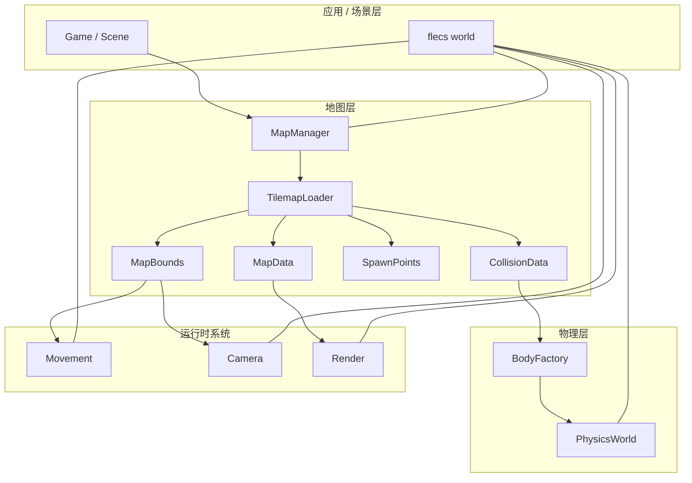

```mermaid
flowchart TB
  subgraph App["应用 / 场景层"]
    Game["Game / Scene"]
    World["flecs world"]
  end

  subgraph Map["地图层"]
    MapManager["MapManager"]
    TilemapLoader["TilemapLoader"]
    MapData["MapData"]
    MapBounds["MapBounds"]
    SpawnPoints["SpawnPoints"]
    CollisionData["CollisionData"]
  end

  subgraph Physics["物理层"]
    PhysicsWorld["PhysicsWorld"]
    BodyFactory["BodyFactory"]
  end

  subgraph Runtime["运行时系统"]
    Movement["Movement"]
    Camera["Camera"]
    Render["Render"]
  end

  Game --> MapManager
  MapManager --> TilemapLoader
  TilemapLoader --> MapData
  TilemapLoader --> MapBounds
  TilemapLoader --> SpawnPoints
  TilemapLoader --> CollisionData

  CollisionData --> BodyFactory
  BodyFactory --> PhysicsWorld

  MapBounds --> Movement
  MapBounds --> Camera
  MapData --> Render

  World --- MapManager
  World --- PhysicsWorld
  World --- Movement
  World --- Camera
  World --- Render

```
